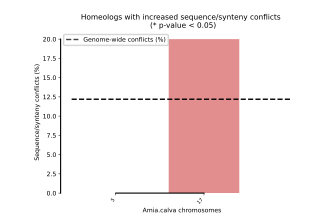
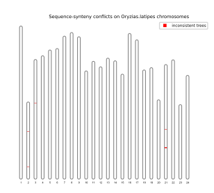
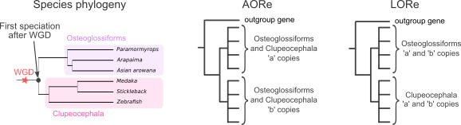
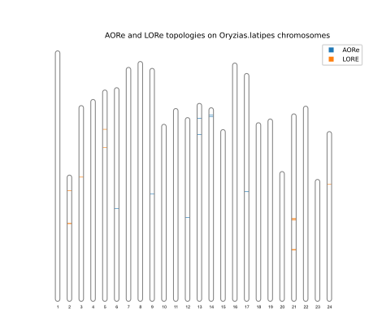

Introducing SCORPiOs LORelEi
=============================

SCORPiOs LORelEi (Lineage-specific Ohnolog Resolution Extension) was introduced in SCORPiOs v2.0.0, to diagnose potential cases of delayed rediploidisation following a whole-genome duplication.

LORelEi does not affect how the SCORPiOs gene tree correction runs (see more details in the :ref:`next section <LORelEi usage instructions>`, along with complete LORelEi usage instructions).

Here, we explain the evolutionary models of post-WGD rediploidisation, and how LORelEi attempts to diagnose them.

Delayed meiosis rediploidisation
---------------------------------

Delayed meiosis rediploidisation after a whole-genome duplication correspond to a prolonged period of recombination between duplicated chromosome pairs. Since recombination delays the divergence of duplicated gene sequences, it typically cause sequence-based gene trees to underestimate the time of duplication. Yet synteny does suggest their WGD-derived origin since they are found in doubly-conserved synteny with a non-duplicated outgroup genome.

In practice, in the presence of delayed meiosis rediploidisation, SCORPiOs attempts to correct sequence-based gene trees to correctly position the duplication, as suggested by synteny. However, since SCORPiOs only corrects gene trees if it is able to find a solution that is both sequence and synteny consistent, the correction might be rejected (if it induces a significant drop of the sequence-based tree likelihood).

LORelEi aims to better analyze these sequence-synteny conflicts (i.e. rejected synteny-guided tree corrections), to identify potential cases of delayed meiosis rediploidisation. 

SCORPiOs LORelEi
-----------------

Diagnostic mode
^^^^^^^^^^^^^^^^

The :code:`diagnostic` mode extracts sequence-synteny conflicts revealed by the gene tree correction performed by SCORPiOs, and analyzes their spatial distribution in modern and ancestral genomes. The underlying rationale is that if conflicts are mainly artifacts due to noise in the data, they should be randomly distributed along genomes. Conversely, if conflicted gene families are in close genomic proximity or belong to specific duplicated chromosome pairs, conflicts can indicate Lineage-specific Ohnolog Resolution, i.e. prolonged recombination of specific genomic regions or chromosomes.

LORelEi leverages SCORPiOs intermediary outputs (the :ref:`gene tree correction summaries <Correction summary>` and the :ref:`synteny-guided constrained tree topologies <Constrained tree topologies>`) to identify conflicted gene trees.

We provide a toy example dataset to illustrate what LORelEi can do. The toy example dataset is comprised of only 41 genes families including 6 teleosts genomes. These genes families come from 2 distinct WGD-duplicated chromosome pairs. LORelEi reveals that sequence-synteny conflicts are over-represented (not significantly) on one of the two pairs of duplicated chromosomes (the pair corresponding to the outgroup *Amia calva* chromosome 17).

While an outgroup genome can be used as a proxy for the pre-duplication karyotype, LORelEi also accepts ancestral karyotype reconstruction.

Finally, LORelEi plots conflicted gene families on the karyotype of a duplicated genome, in the example the medaka fish (*Oryzias latipes*). Here are example plots generated by LORelEi diagnostic on the toy dataset:

Full usage instructions to reproduce the example plots are presented in the :ref:`next section <Example 1: SCORPiOs LORelEi diagnostic mode>`. 

Likelihood-tests mode
^^^^^^^^^^^^^^^^^^^^^^

Two classes of gene trees can be defined depending on the relative timing of meiosis resolution and species divergence. AORe (Ancestral Ohnolog Resolution) gene treez correspond to gene trees for which meiosis was resolved **before** speciation, while LORe (Lineage-specific Ohnolog Resolution) gene trees are trees for which meiosis was resolved **after** speciation.

The :code:`likelihood_tests` mode directly confronts and tests the AORe versus LORe gene tree hypotheses, and displays the location of AORe and LORe gene families on the karyotype of a duplicated genome. The :code:`likelihood_tests` mode requires more computation time and ressources because it computes the likelihood of the trees in each model, whereas the :code:`diagnostic` mode only extracts outputs already provided by SCORPiOs. We recommend running LORelEi in :code:`diagnostic` mode first and then in :code:`likelihood_tests` mode to confirm the results, if the conflicted gene families appear non-randomly distributed and conflicted gene tree topologies are compatible with LORe.

LORelEi tests the rediploidisation status at the earliest speciation time point after the WGD. The example below show the AORe and LORe gene tree topologies confronted in LORelEi for the teleost species phylogeny of the toy dataset:

In the toy example dataset, LORelEi :code:`likelihood_tests` confirms that conflilcted gene families revealed by LORelEi :code:`diagnostic` can be explained by LORe, while revealing additional LORe gene families:

Full usage instructions to reproduce the example plot are presented in the :ref:`next section <Example 2: SCORPiOs LORelEi likelihood_tests mode>`. 

